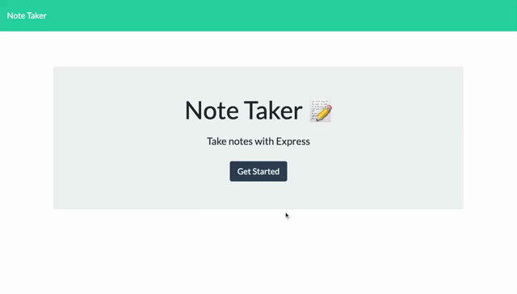

# Express Note Taker

## Description
A web application that allows a user to create notes & save them via Express, so they can be accessed later on. 

---

## Table of Contents
* [Usage](#usage)
* [License](#license)
* [Contributing](#contributing)
* [Questions](#questions)

---

## Usage
Access the deployed application here: [Express_Note_Taker](https://mysterious-castle-46463.herokuapp.com/)

To begin, click the "Get Started" button on the home page. This will open the Notes page, where you can create a note simply by clicking into the textarea on the right side. Add your note's title & body, and then click the save icon in the top right corner. Each new note will be saved in the column on the left. To view the content of a previous note, click the note's title in the left side column, and the note will appear on the right. If you'd like to add another note, simply click the plus sign in the top right corner.

---

## License
This project is licenced by [MIT](https://choosealicense.com/licenses/mit/).

---

## Contributing
If you'd like to contribute, please contact me via the email listed below. 

---

## Questions
View all of my projects on [GitHub](https://github.com/lola-violet).

If you have any questions or want to contribute, please contact me via email at [lolaviolet.dev@gmail.com](mailto:lolaviolet.dev@gmail.com).